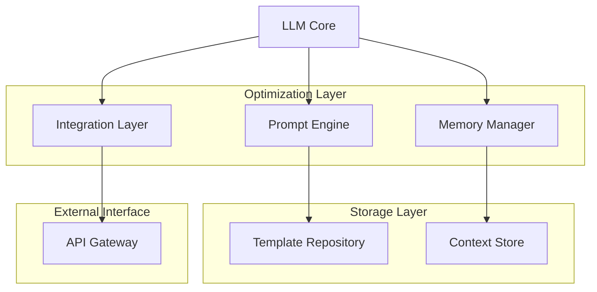

# LLM Integration Framework 2025

## 1. Архитектурная концепция

### 1.1 Основные компоненты


## 2. Технические спецификации

### 2.1 Ядро системы
```json
{
  "core_components": {
    "llm_engine": {
      "primary": "GPT-4",
      "fallback": "Claude-3",
      "optimization": {
        "context_window": 128000,
        "token_limit": 4000,
        "memory_management": "dynamic"
      }
    },
    "memory_system": {
      "type": "hierarchical",
      "layers": [
        {"name": "short_term", "retention": "24h"},
        {"name": "long_term", "retention": "permanent"},
        {"name": "working", "retention": "session"}
      ]
    }
  }
}
```

### 2.2 Интеграционный слой
```python
class LLMIntegrationLayer:
    def __init__(self):
        self.prompt_engine = PromptEngine()
        self.memory_manager = MemoryManager()
        self.api_gateway = APIGateway()
        
    async def process_request(self, input_data):
        context = self.memory_manager.get_context()
        prompt = self.prompt_engine.optimize(input_data, context)
        response = await self.api_gateway.send_request(prompt)
        self.memory_manager.update(response)
        return response
```

## 3. Оптимизация промптов

### 3.1 Шаблоны промптов
```yaml
prompt_templates:
  system_context:
    format: |
      Role: {role}
      Objective: {objective}
      Constraints: {constraints}
      Output_format: {format}
  
  chain_of_thought:
    format: |
      Given the context: {context}
      Step 1: Analyze the input
      Step 2: Break down the problem
      Step 3: Generate solution
      Step 4: Validate output
```

## 4. Метрики производительности

### 4.1 Ключевые показатели
| Метрика | Целевое значение | Метод измерения |
|---------|------------------|-----------------|
| Latency | < 500ms | API response time |
| Accuracy | > 95% | Validation tests |
| Token efficiency | < 2000 per request | Token counter |
| Memory utilization | < 85% | System monitoring |

## 5. Рекомендации по внедрению

### 5.1 Приоритеты внедрения
1. **Базовая интеграция**
   - Настройка API подключений
   - Установка базовых промптов
   - Конфигурация памяти

2. **Оптимизация**
   - Тюнинг промптов
   - Настройка кэширования
   - Оптимизация контекста

3. **Расширение функциональности**
   - Интеграция дополнительных моделей
   - Внедрение специализированных агентов
   - Разработка пользовательских интерфейсов

### 5.2 Чек-лист внедрения
```markdown
- [ ] Настройка базовой инфраструктуры
  - [ ] API ключи и доступы
  - [ ] Системы мониторинга
  - [ ] Базовые промпты

- [ ] Интеграция компонентов
  - [ ] Подключение LLM моделей
  - [ ] Настройка памяти
  - [ ] Конфигурация API Gateway

- [ ] Оптимизация и тестирование
  - [ ] Валидация промптов
  - [ ] Тесты производительности
  - [ ] Проверка безопасности
```

## 6. Безопасность и мониторинг

### 6.1 Конфигурация безопасности
```json
{
  "security_config": {
    "api_rate_limiting": {
      "requests_per_minute": 60,
      "burst_limit": 100
    },
    "authentication": {
      "method": "OAuth2",
      "token_lifetime": "1h"
    },
    "data_protection": {
      "encryption": "AES-256",
      "pii_detection": true
    }
  }
}
```

## 7. Дальнейшее развитие

### 7.1 Дорожная карта
- **Q1 2025**: Базовая интеграция и оптимизация
- **Q2 2025**: Расширение функциональности
- **Q3 2025**: Автоматизация и самообучение
- **Q4 2025**: Полная автономность системы